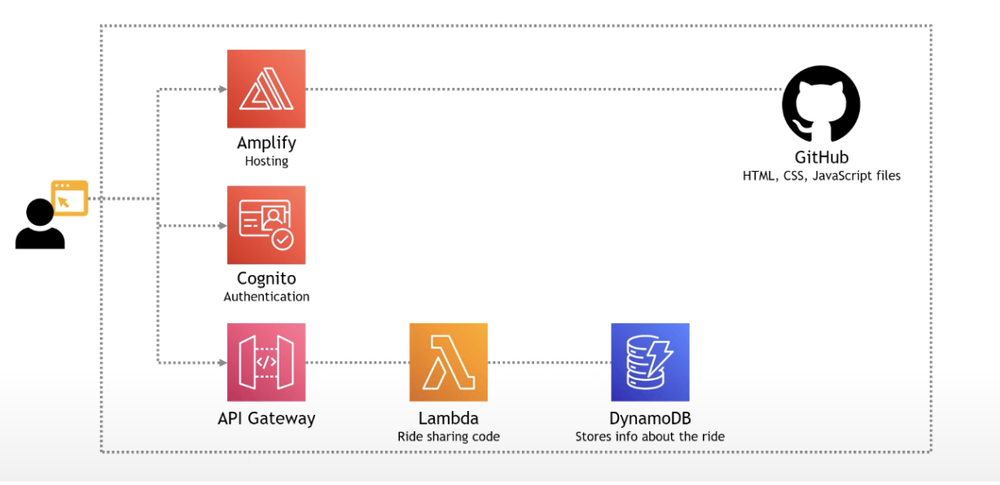
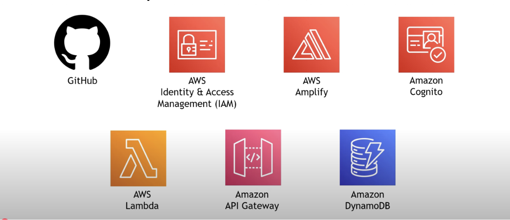

## Architecture Overview of My AWS-Based App

In this project, I developed a serverless web application that integrates various AWS services to provide a seamless and scalable solution. The architecture leverages AWS Amplify, Amazon Cognito, AWS Lambda, Amazon DynamoDB, and Amazon API Gateway to deliver an efficient and secure user experience.

### Core Components

1. **AWS Amplify**:
   - **Role**: Hosting the frontend of the application.
   - **Functionality**: AWS Amplify serves as the backbone for hosting the web application. It enables the continuous integration and deployment (CI/CD) pipeline, ensuring that updates to the frontend are automatically reflected in the live environment. It also simplifies the process of connecting the frontend with various backend services.

2. **Amazon Cognito**:
   - **Role**: User authentication and authorization.
   - **Functionality**: Amazon Cognito handles user registration, sign-in, and access control. It allows users to securely authenticate with their email, or third-party identity providers such as Google or Facebook. Cognito’s user pool and federated identities ensure that user data is securely managed and easily integrated with other AWS services.

3. **AWS Lambda**:
   - **Role**: Backend computation and business logic.
   - **Functionality**: AWS Lambda is used for executing the app’s core business logic without the need for a dedicated server. Functions are triggered by user requests (such as requesting a ride or processing data), and Lambda performs the necessary computation and interacts with other services like DynamoDB to store data. The serverless nature of Lambda ensures scalability and cost-efficiency.

4. **Amazon DynamoDB**:
   - **Role**: NoSQL database for storing and retrieving data.
   - **Functionality**: Amazon DynamoDB is used to store application data in a key-value format. It is a NoSQL database that can handle high throughput and low-latency data access. In this app, DynamoDB stores user requests, ride information, and other relevant data points, allowing for quick retrieval when needed.

5. **Amazon API Gateway**:
   - **Role**: API management and routing.
   - **Functionality**: API Gateway acts as the interface between the frontend and backend services. It enables the creation of RESTful APIs that allow the web app to communicate with Lambda functions. API Gateway also integrates with Amazon Cognito to secure API access and enforce authentication.

### Flow of the Application

1. **User Authentication**: When a user visits the app, they are first prompted to sign up or log in using Amazon Cognito. After successful authentication, a JSON Web Token (JWT) is issued to the user, which is used to validate future requests.

2. **Frontend Interactions**: Once authenticated, users can interact with the web app (hosted on AWS Amplify). Requests such as booking a ride or requesting information are made through HTTP requests to API Gateway.

3. **Backend Logic Execution**: API Gateway routes these requests to the appropriate AWS Lambda function. Lambda processes the request (e.g., selecting a unicorn or storing ride details), interacting with other services like DynamoDB for data storage.

4. **Data Storage**: All ride requests and user data are securely stored in Amazon DynamoDB. This ensures that data is persistent, easily accessible, and highly available.

5. **Response to User**: After the request is processed, Lambda sends the response back through API Gateway to the frontend. The user can then see the result (e.g., confirmation of a ride request or an error message).

### Benefits of the Architecture

- **Scalability**: Each component of the system (Amplify, Lambda, Cognito, etc.) scales independently, ensuring the app can handle a growing number of users without any manual intervention.
- **Cost-Efficiency**: The serverless nature of Lambda and the pay-per-use model of DynamoDB and API Gateway means that we only pay for the resources we use, keeping costs low.
- **Security**: Using Amazon Cognito for authentication ensures that users’ data is secure, and access to backend services is controlled and validated using JWTs.

### Conclusion

This architecture is designed to be both robust and flexible, making it ideal for building modern web applications. By leveraging AWS’s powerful suite of serverless services, this app provides high availability, security, and scalability with minimal operational overhead.

