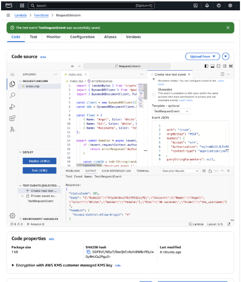

# Building a Serverless Ride-Sharing Application Using AWS

In this blog post, I will walk you through building a serverless ride-sharing application using AWS services such as AWS Amplify, Amazon Cognito, AWS Lambda, Amazon DynamoDB, AWS Identity and Access Management (IAM), and Amazon API Gateway. This application will simulate a ride-sharing service where users can request a unicorn ride, and the system will authenticate users, store their requests, and process them without needing to set up traditional servers. The HTML and frontend code is courtesy of AWS Services and can be found on numerous Git Repos.

## Materials Required:
1. **AWS Account**: You need an AWS account to use the services mentioned in this tutorial.
2. **GitHub Account**: To manage and store your code.
3. **Text Editor**: I personally used Visual Studio Code, but you can also use TextEditor or Notepad++.
4. **Basic Knowledge of AWS**: Familiarity with AWS services like Cognito, Lambda, API Gateway, and DynamoDB.

## Overview:
The application has a few key components:
- **Web Hosting**: The webpage where users will interact.
- **Authentication**: User registration and login via Amazon Cognito.
- **Backend Logic**: The math and logic to dispatch unicorns.
- **Data Storage**: Using DynamoDB to store the requests.
- **Permissions**: Ensuring only authorized users can request rides.

## Step-by-Step Guide:

### 1. **Creating and Hosting the Webpage with AWS Amplify**

The first step in this process is setting up a webpage. We will use AWS Amplify, a great service for front-end developers, to build and host our webpage.

- **GitHub Setup**: Create a GitHub repository and copy the template `wildrydes-site`. This template contains all the HTML code for the site, and AWS Services have provided this template, though it is no longer publicly available. 
- **Deploying the Website**: 
  - Navigate to AWS Amplify → Create new app → Deploy app from GitHub → Add the repository → Deploy.
  - AWS Amplify will automatically build and deploy the static webpage whenever you make changes to the GitHub repository. 

**Testing the CI/CD Pipeline**:  
Once the website is hosted, test the CI/CD pipeline by editing some HTML code in the GitHub repository. You should see a new deployment initiated in AWS Amplify when changes are made. 

### 2. **Adding User Registration and Login with Amazon Cognito**

For user authentication, we use Amazon Cognito, which allows users to register and log in using their email or external identity systems like Facebook, Amazon, or SAML/OpenID providers.

- **Create a User Pool in Amazon Cognito**:
  - Navigate to Cognito → Create User Pool → Choose Single-page application (SPA) → Name your application (e.g., "Client App Name").
  - Set sign-in identifiers as `Username` and use `Email` as the attribute.
  - Grab the **User Pool ID** and **Client ID** from the App Integration tab.

- **Configure the Web App**:
  - Go to your GitHub repository and update the `config.js` file with the Cognito **User Pool ID** and **Client ID**.
  - This will allow the web app to authenticate users with Cognito.
  - Test by signing up for the app. After registration, a verification email will be sent, and once verified, you can log in.

### 3. **Storing Ride Requests in Amazon DynamoDB**

To store the ride requests, we use Amazon DynamoDB, a NoSQL key-value database that is lightweight and highly scalable.

- **Create a DynamoDB Table**:
  - Navigate to DynamoDB → Tables → Create new table.
  - Label the table as "Ride" and set the partition key as `RideID` (type: string).

- **IAM Role for Lambda**:
  - Create an IAM role to allow AWS Lambda to write to the DynamoDB table.
  - Navigate to IAM → Roles → Create new Role → Select AWS Lambda as the trusted entity → Attach permission policies (AWSLambdaBasicExecution) → Name the role `WildRydesLambda`.
  - Add an inline policy allowing Lambda to insert items into DynamoDB.

### 4. **Creating the Lambda Function for Ride Sharing**

Now we need to create an AWS Lambda function to handle ride-sharing requests. This function will select a unicorn from the fleet and store the request in DynamoDB.

- **Create Lambda Function**:
  - Navigate to Lambda → Create new function → Select "Author from scratch".
  - Assign the role `WildRydesLambda` to the Lambda function.
  - Add the function code from your GitHub repository and deploy it.

- **Testing the Lambda Function**:
  - Create a test event in Lambda and deploy the function.
  - After testing, you should see a status code `201`, and the DynamoDB table should have a new entry for the ride request.

### 5. **Creating an API Gateway to Invoke Lambda Function**

To allow users to request a unicorn from the webpage, we need to expose the Lambda function as a REST API using Amazon API Gateway.

- **Create a REST API**:
  - Navigate to API Gateway → Create REST API.
  - Create an **Authorizer** to authenticate the API requests. Use Cognito as the authorization method and configure it to use JWTs returned by Cognito.
  - Test the API using the token from the Cognito sign-in process. If the request is successful, you will see a status code of `200`.

- **Create a Resource and Method**:
  - Add a resource in API Gateway to connect the Lambda function.
  - Create a method (e.g., GET or POST) to invoke the Lambda function.

- **Create a Stage**:
  - Create a stage to access the invoke URL, such as `https://p5u2twcyq5.execute-api.us-east-1.amazonaws.com/dev`.

- **Update the Web App Config**:
  - Go back to GitHub and update the `config.js` file with the new invoke URL. This will trigger a new deployment in AWS Amplify.

### 6. **Final Testing and Troubleshooting**

Test the full application by visiting the deployed website. Attempt to request a unicorn. If you encounter issues like “an error occurred when requesting your unicorn: undefined,” follow these troubleshooting steps:

- **Check CORS (Cross-Origin Resource Sharing) Settings** in API Gateway.
- **Manually Test the API Gateway Endpoint** to ensure it works as expected.
- **Check AWS Lambda Logs** using CloudWatch. Look for any issues with permissions, missing configurations, or API Gateway problems.

**Error Analysis**: In this case, the error message “Cannot read properties of undefined (reading 'authorizer')” suggested that the Lambda function was missing an `authorizer` property. By verifying the API Gateway configuration and ensuring that authorization data was properly passed, I resolved the issue and was able to successfully request a unicorn.

### Conclusion:
This project involved combining multiple AWS services to build a serverless ride-sharing application. From hosting the website with AWS Amplify, authenticating users with Cognito, and executing backend logic with Lambda, to storing ride requests in DynamoDB and exposing the functionality via API Gateway—each step provided valuable learning experiences. Troubleshooting the final error highlighted the importance of understanding AWS services’ configurations, especially when dealing with authentication and permissions. It taught me how to troubleshoot further with Amazon CloudWatch we was a service I didn't have to much previous experience with! In CloudWatch, I learned how to read logs and debug issues that my app was having.

By the end of this project, I not only created a fun and functional application but also gained deeper insights into serverless architectures and the integration of AWS services.
